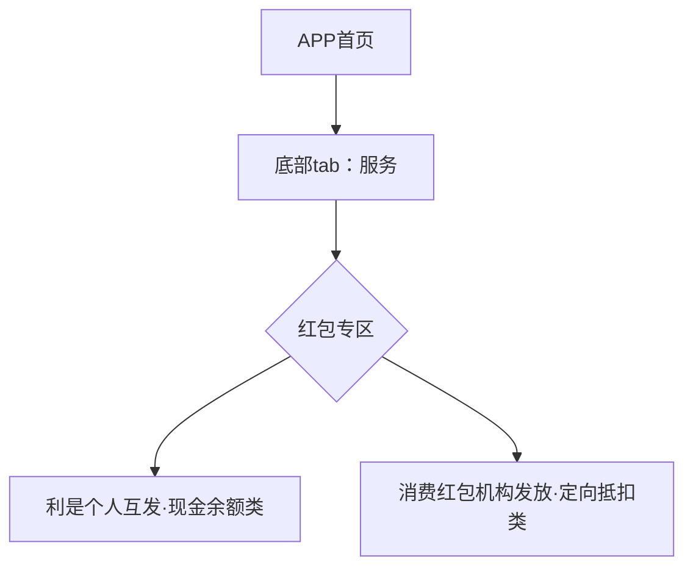
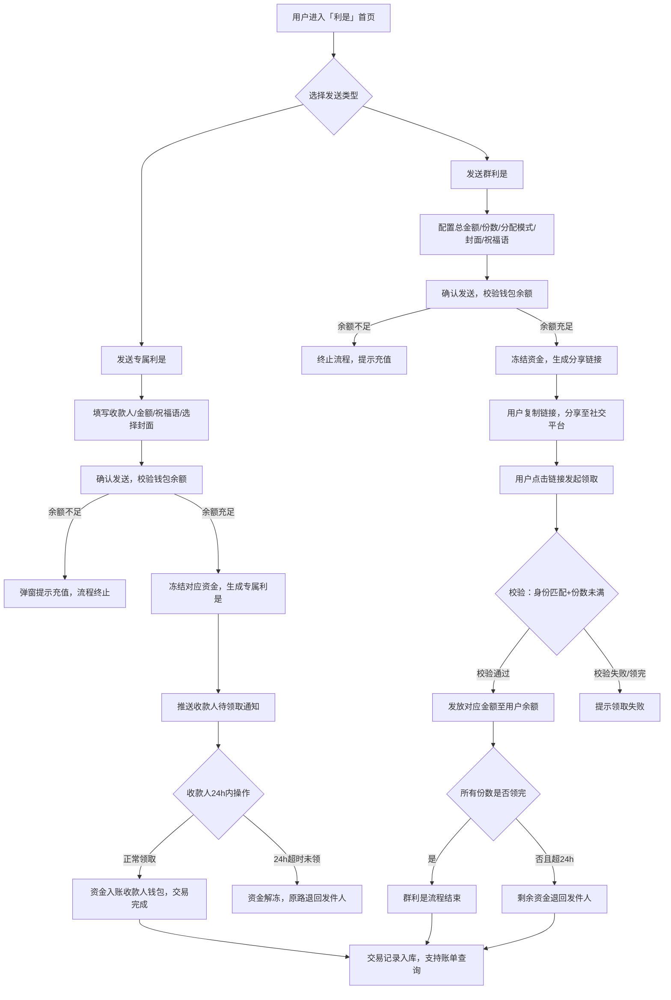
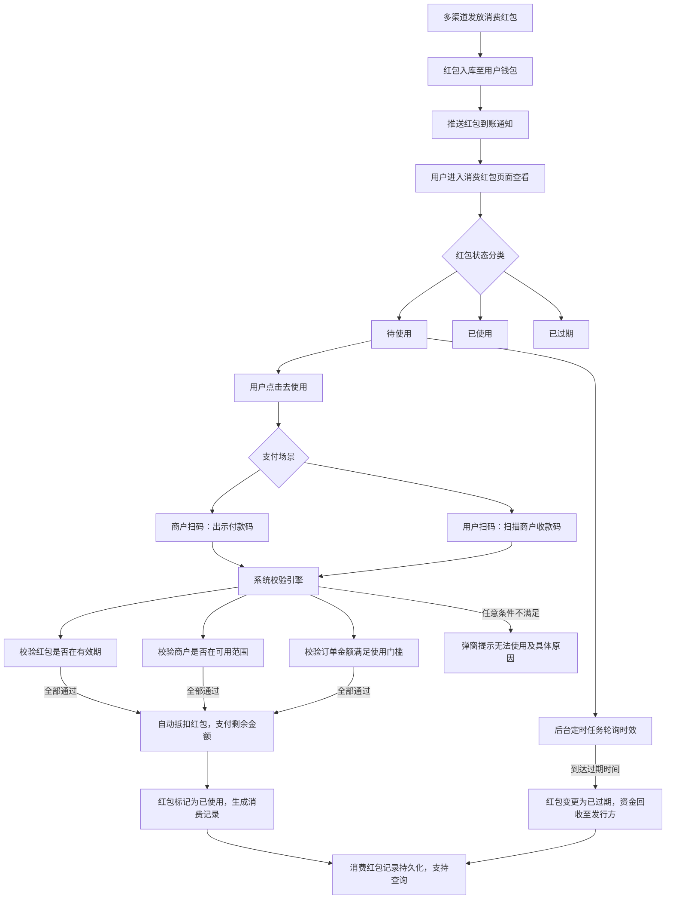

# 澳门元数字钱包APP\-利是及消费红包模块产品需求说明书（PRD）V1\.0

## 文档信息

|项目|内容|
|---|---|
|文档名称|澳门元数字钱包APP利是、消费红包模块PRD|
|版本号|V1\.0|
|适配币种|澳门元（MOP）|
|迭代模块|利是（原数字人民币现金红包）、消费红包|
|生效场景|澳门元数字钱包移动端APP（iOS/Android）|
|文档用途|研发开发、UI设计、测试验收、产品复盘、项目交付|

## 术语替换规范

- 数字人民币APP → 澳门元数字钱包APP

- 现金红包 → **利是**（全场景统一替换）

- 消费红包 → 消费红包（保留原名）

- 结算币种：统一使用 澳门元（MOP），全页面、后台数据、日志统一展示

## 核心业务区分定义

- **利是（个人现金类）**：个人用户相互发放，无消费门槛、无指定商户，领取后资金直接计入钱包可用余额，可自由支付、转账、兑回银行；超时未领取资金原路退回发件人，属于个人现金资产。

- **消费红包（机构补贴类）**：政府、商户、运营机构官方发放的定向补贴，不计入钱包余额；有有效期、消费门槛、指定商户范围，不可转账、不可提现，过期资金回收至发行机构。

---

# 一、整体入口架构与总流程

## 1\.1 功能统一入口

澳门元数字钱包APP → 底部Tab【服务】→ 红包专区双入口：【利是】【消费红包】并列展示

## 1\.2 整体架构流程图（支持缩放）

## 1\.3 对应UI页面说明

**UI页面：APP服务主页**

- 核心元素：卡片式独立入口「利是」「消费红包」

- 辅助元素：消费红包区域悬浮展示用户可用红包总额快捷提示

- 样式规范：澳门本地化简约风格，繁体中文展示

---

# 二、利是模块（原现金红包）详细需求

## 2\.1 完整细分功能点

### 2\.1\.1 发利是核心类型

#### （1）专属利是（定向单人）

- 支持收款人录入：手动输入手机号、读取手机通讯录选择联系人

- 单人单笔固定金额，一对一定向发放，仅指定用户可领取

- 自定义配置：澳门节庆利是封面、自定义祝福语（字数后台限制）

#### （2）群利是（社交分享领取）

提供三种分配模式，用户可自由选择：

- 等额利是：所有领取者获得金额一致

- 拼手气利是：系统随机分配每份金额，金额高低随机

- 拼手速利是：优先领取用户金额更高，晚领金额递减

可配置参数：总澳门元金额、利是份数（后台配置上下限）、祝福语、利是封面；生成专属分享链接，支持WhatsApp、短信、社交平台转发。

### 2\.1\.2 支付与风控规则

- 资金来源：仅从澳门元数字钱包可用余额扣除

- 余额不足实时拦截，弹窗提示用户充值后重试

- 限额管控：后台可配置单笔限额、单日累计发送限额、单人接收限额

- 发送二次确认机制，避免误操作

- 风控拦截：高频发送、异地异常登录、大额匿名发送触发人脸核验/拦截

### 2\.1\.3 领取与时效规则

- 领取校验：领取人实名手机号需与发链接收款校验信息一致，非本人无法领取

- 资金到账：领取成功后，金额实时划入钱包可用余额，可任意支付、转账、兑回

- 有效期：利是创建生效起 **24小时有效**

- 超时机制：24小时未领取/未领完剩余金额，自动解冻原路退回发件人钱包

- 防重复领取：同一用户对同一份利是仅可领取一次

### 2\.1\.4 利是记录体系

- 双标签分类：我发出的利是、我收到的利是

- 列表展示字段：金额、发送/领取时间、当前状态（待领取/部分领取/全部领取/已过期退回）

- 详情页能力：群利是展示完整领取清单、领取人、领取时间、单份金额、退回明细

### 2\.1\.5 附加增值能力

- 本地化封面：春节、端午、中秋、澳门回归节庆等专属利是封面

- 全场景消息推送：待领取提醒、领取完成通知、超时退回通知

- 分享链接时效与利是有效期同步，过期链接失效无法打开

## 2\.2 利是完整业务流程图（支持缩放）

## 2\.3 全流程分步UI页面说明

所有流程步骤一一对应独立UI页面，覆盖全操作场景

1. **利是首页UI**：核心按钮【发专属利是】【发群利是】，下方入口【我的利是记录】，展示近期交易简要信息

2. **专属利是编辑页UI**：手机号输入/通讯录选择、MOP金额输入框、祝福语输入、封面横向选择器、底部确认发送按钮，展示限额规则提示

3. **群利是参数编辑页UI**：总金额、份数输入框，等额/拼手气/拼手速单选按钮，祝福语、封面选择，限额文字提示

4. **发送确认弹窗UI**：汇总展示总金额、接收方、利是样式，配置【确认发送】【取消】操作按钮

5. **利是分享页UI**：展示利是封面、祝福语、金额概要，支持复制链接、分享WhatsApp、短信分享

6. **领取弹窗UI**：外部链接跳转后展示发件人信息、利是封面，一键领取按钮；身份不匹配时展示无权领取提示

7. **领取成功页UI**：展示领取金额、到账提示，配置【去钱包查看余额】跳转按钮

8. **利是记录列表UI**：双Tab切换（我发出/我收到），卡片式展示每条记录状态、金额、时间

9. **利是详情页UI**：展示完整交易明细、领取清单、退回记录、时效信息

10. **超时退回通知页UI**：明确提示超时原因、退回金额、资金已返还钱包

---

# 三、消费红包模块详细需求

## 3\.1 完整细分功能点

### 3\.1\.1 红包发放渠道

- 运营后台批量下发：政府惠民活动、商户营销活动、平台运营活动

- APP内任务领取：签到、消费任务、抽奖、积分兑换获取

- 外部渠道下发：合作小程序、官方活动页面跳转领取

所有渠道领取的红包自动归集至用户实名钱包消费红包列表，独立存储、独立管控。

### 3\.1\.2 消费红包类型（后台可配置）

- 无门槛红包：任意消费场景均可抵扣，无金额限制

- 满减红包：满足指定消费金额方可抵扣（例：满100MOP减30MOP）

- 品类限定红包：仅限餐饮、零售、交通、美妆等指定行业核销

- 门店限定红包：仅签约指定澳门本地商户门店可用

### 3\.1\.3 核心使用规则

- 资产属性：不计入钱包余额，仅用于消费抵扣，不支持转账、提现、兑回银行

- 时效规则：独立有效期（精确到时分），后台统一配置

- 抵扣优先级：系统自动优先抵扣即将过期红包，减少用户资产流失

- 叠加规则：后台可配置单单可叠加/不可叠加多张红包

- 核销规则：一次性核销，不找零、不可拆分使用，剩余差额自动作废

- 退款规则：全额退款且红包在有效期内可退回账户，过期不返还；部分退款红包不予退回

### 3\.1\.4 前端核心能力

- 红包列表：待使用、已使用、已过期三状态Tab分类，展示面额、门槛、有效期、适用范围

- 红包详情：完整使用规则、有效期、可用商户说明、去使用、查看附近商户入口

- 付款码核销：商户扫码支付时，系统自动匹配可用红包，弹窗展示抵扣金额

- 扫码支付核销：用户主动扫商户码，结算页手动/自动选用红包抵扣

- 商户地图：定位澳门地区，展示可用核销商户，支持导航、筛选

### 3\.1\.5 消息通知能力

- 红包到账通知、红包即将过期预警（到期前24小时）

- 红包核销成功通知、红包过期失效通知

## 3\.2 消费红包完整业务流程图（支持缩放）

## 3\.3 全流程分步UI页面说明

1. **消费红包首页列表UI**：待使用/已使用/已过期三Tab，顶部展示可用红包总额，卡片展示面额、使用门槛、倒计时有效期

2. **红包详情页UI**：红包大图展示、完整使用规则、有效期、适用商户类型、【去使用】【查看附近商户】按钮

3. **商户地图页面UI**：澳门区域定位、核销商户标记、商户筛选、一键导航功能

4. **付款码抵扣弹窗UI**：自动展示本次可抵扣红包、抵扣后应付金额、确认支付按钮

5. **扫码结算红包选择UI**：订单金额下方展示可用红包列表，支持手动切换选用

6. **过期预警通知UI**：推送消息\+APP内弹窗双重提醒即将过期红包

7. **消费记录页面UI**：展示抵扣金额、消费商户、交易时间、红包编号、订单明细

8. **过期红包页面UI**：展示过期时间、失效说明，明确不可再次核销使用

---

# 四、公共通用功能与规则

## 4\.1 通用功能

- 消息统一收纳：利是、消费红包所有通知统一归集至APP消息中心

- 实名权限管控：未完成实名认证用户，限制发送利是、领取大额红包

- 安全风控：异常操作、高频交易触发风控拦截与人脸核验

- 多钱包隔离：用户名下多个澳门元钱包，利是、消费红包数据相互独立不互通

- 分享截图：支持利是封面、消费红包卡片截图、社交分享

## 4\.2 核心模块差异对比表

|对比项目|利是（现金类）|消费红包（补贴类）|
|---|---|---|
|资金归属|计入钱包余额，等同现金资产|专项补贴，不计入余额|
|发放主体|个人用户|政府/商户/运营机构|
|转账/提现|完全支持|完全不支持|
|使用限制|无门槛、无商户限制|有效期、商户、金额门槛限制|
|过期处理|未领资金原路退回发件人|资金回收至发行机构|
|核销方式|可任意拆分使用|一次性核销，不可拆分、不找零|

# 五、非功能需求

- **并发性能**：利是领取、消费红包核销支持高并发场景，秒杀、节日峰值不卡顿、不超卖

- **数据一致性**：资金冻结、解冻、红包状态变更严格事务控制，杜绝资金损失、状态异常

- **本地化适配**：全页面繁体中文展示，适配澳门本地用语、MOP币种展示、本地节庆场景

- **端侧兼容**：iOS、Android两端UI交互、功能逻辑完全统一，适配主流机型尺寸

- **可离线查阅**：本文档纯Markdown格式，无在线依赖，本地打开可完整查看流程图与内容

# 六、版本更新记录

|版本|更新时间|更新内容|
|---|---|---|
|V1\.0|2026\-08\-13|首次定稿，完整覆盖利是、消费红包全功能点、流程图、UI说明、规则体系|

> （注：部分内容可能由 AI 生成）
